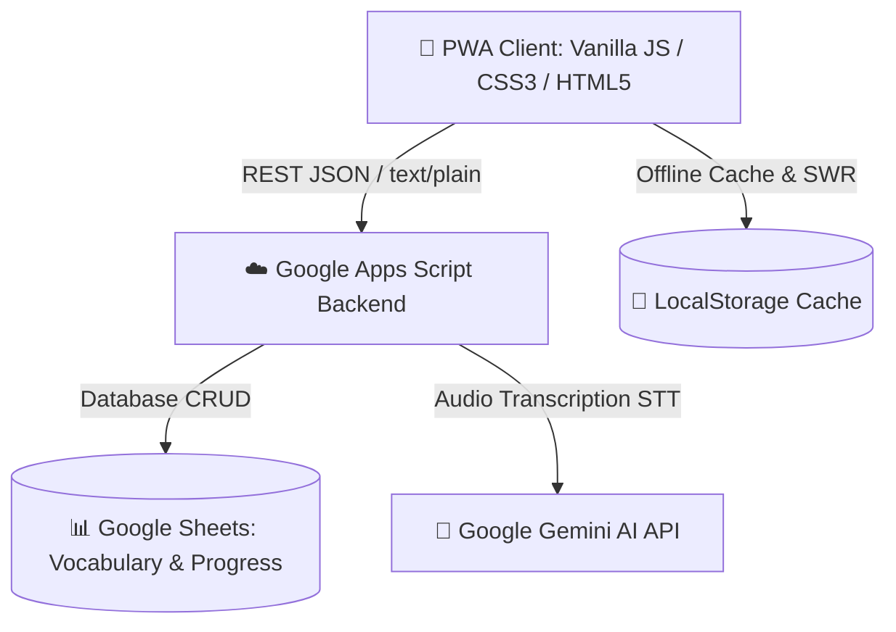

# 🦉 English Trainer (My Duolingo)

> Современное, быстрое и удобное веб-приложение (PWA) для изучения английского языка с акцентом на **частотность слов (Zipf)**, **умное интервальное повторение** и **AI-оценку произношения**.

🔗 **Live Demo:** [https://sway-nick.github.io/my-duolingo/](https://sway-nick.github.io/my-duolingo/)

---

## 🌟 Ключевые преимущества и методология

### 📊 1. Частотный подход (Шкала Zipf)
- **Приоритет самых нужных слов:** Внутри выбранной категории слова автоматически упорядочиваются по **логарифмической шкале частотности Zipf**.
- Пользователь в первую очередь осваивает лексику, которая чаще всего встречается в реальной речи, фильмах и литературе, не тратя время на редкие термины в начале обучения.

### 🧠 2. Умное интервальное повторение (Spaced Repetition)
- **4-ступенчатая воронка закрепления:** 
  $$\text{Карточки} \longrightarrow \text{Квиз} \longrightarrow \text{Пары} \longrightarrow \text{Ввод слова}$$
- **Регулярный подмес пройденных слов (15%):** в тренировки автоматически добавляются уже выученные слова, требующие повторения, чтобы гарантировать переход лексики в долговременную память.
- **Интеграция Избранного:** трудные слова из списка «Избранное» органично вплетаются в текущие сессии и могут запускаться отдельным интенсивным блоком.

### 🎙️ 3. Оценка произношения на базе AI (Google Gemini STT):
- **Сверхбыстрое распознавание речи:** чистая ASR-транскрипция аудиопотока через специализированные модели Gemini (`gemini-3.5-transcribe`, `gemini-3.5-flash-lite`, `gemini-2.5-flash`) со скоростью отклика ~1–2 секунды.
- **Фонетический анализ точности:** алгоритмическая оценка качества произношения в процентах с пониманием акцентов и подсказками по проблемным звукам.
- **Режим «✍️ Не могу говорить»:** быстрый переход к тренировке правописания (вставка пропущенных согласных букв) в тихих местах и транспорте.

---

## 🚀 Основные возможности

### 🗂️ 4 Режима интеллектуальной тренировки:
1. **🗂️ Карточки (Cards):** Первичный отбор слов на день с учётом дневного лимита (10, 20, 30... слов) и сортировкой по частотности Zipf.
2. **🎯 Квиз (Quiz):** Выбор правильного перевода из 4 вариантов с интеллигентным подмесом избранных слов и пройденного материала.
3. **🧩 Пары (Pairs):** Интерактивное сопоставление 6 пар слов на скорость с плавной 3D-анимацией переворота карточек и звуками звонких монеток.
4. **✍️ Ввод слова (Input Test):** Ввод английского слова с клавиатуры по переводу с системой закрепления (финальная ступень мастерства слова).

### 🏆 Лига недели и Геймификация:
- **Соревновательный рейтинг:** Топ лидеров недели с пьедесталом и наградами (💎 Алмаз, 🥇 Золото, 🥈 Серебро, 🥉 Бронза).
- **Живой опыт (XP):** Начисление очков за правильные ответы (`+1..+3 XP`) и штрафы за ошибки (`-5 XP`). Автоматический сброс лидерборда каждый понедельник в 00:00 UTC.

### 👥 Мультипользовательский режим и Cloud-Sync:
- **Гостевой режим (Guest):** Мгновенный старт без регистрации с сохранением прогресса в `localStorage`.
- **Облачная авторизация:** Вход по Email с мгновенной синхронизацией прогресса, словаря и настроек через Google Apps Script & Google Sheets.

### 🎭 Персонализация и звуковой комфорт:
- **Галерея из 16 векторных аватарок** + загрузка собственного фото с автокадрированием.
- **Озвучка слов (SpeechSynthesis)** с поддержкой естественных голосов и режимом «Черепашка» (замедление на 3-й клик подряд).
- **Светлая и тёмная темы** оформления.

---

## 🛠️ Архитектура и стек технологий



- **Frontend:** Vanilla JavaScript (ES6+ Modules, No Heavy Frameworks, 60 FPS UI), Vanilla CSS3 (Custom Variables, 3D Transforms), Web Audio API, MediaRecorder.
- **Backend:** Serverless Google Apps Script (`Code.gs`), Google Sheets API.
- **AI & Speech:** Google Gemini API (`generateContent` with fallback queue).
- **Сборка и развёртывание:** Node.js Sync Script (`scripts/build.cjs`), GitHub Pages CI/CD.

---

## 💻 Локальная разработка

1. Клонировать репозиторий:
   ```bash
   git clone https://github.com/sway-nick/my-duolingo.git
   cd my-duolingo
   ```

2. Вносить изменения в исходные файлы папки `frontend/` и `backend/src/`.

3. Синхронизировать сборку в `docs/` и корень:
   ```bash
   node scripts/build.cjs
   ```

4. Открыть `frontend/index.html` или `docs/index.html` в браузере (или через Live Server / Any static HTTP server).
