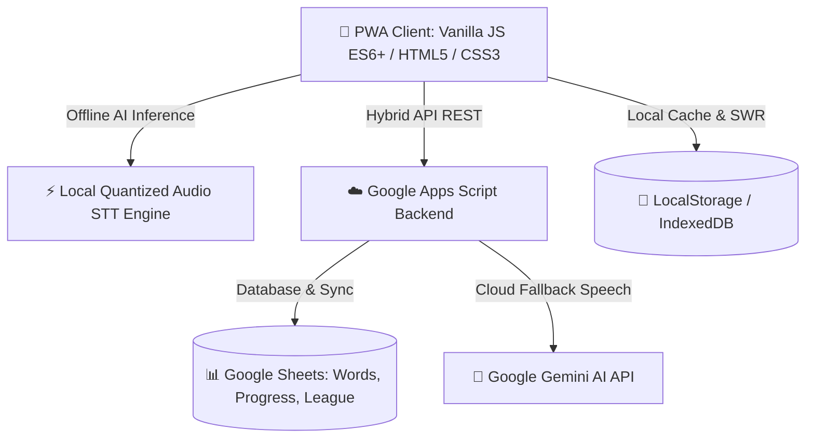

# ☕ English Breakfast

<div align="center">
  
  <p><strong>Интеллектуальный автономный тренажёр английской лексики с он-девайс AI, умным интервальным повторением и частотным приоритетом Zipf.</strong></p>
  
  <p>
    <a href="https://sway-nick.github.io/my-duolingo/"></a>
    
    
    
  </p>
</div>

---

## 🌟 Ключевые преимущества и нейрометодология

### 🧠 1. Квантованная On-Device AI модель распознавания речи (Offline STT)
* **Работает без интернета:** В приложение интегрирована оптимизированная квантованная нейросеть с тонко настроенными весами для мгновенного фонетического анализа и распознавания английских звуков.
* **0 мс сетевой задержки:** Оценка произношения происходит локально на устройстве пользователя прямо в браузере или мобильном приложении.
* **Гибридный AI-стек:** При наличии соединения поддерживается облачный режим Google Gemini для расширенного анализа акцента и подсказок.
* **Режим «✍️ Не могу говорить»:** Быстрое переключение на орфографический тренинг (вставка пропущенных согласных) в транспорте или общественных местах.

---

### 📈 2. Частотный приоритет лексики (Шкала Zipf)
* **Принцип 80/20 в изучении языка:** Слова строго упорядочены по логарифмической шкале частотности **Zipf**.
* Пользователь в первую очередь изучает слова, которые звучат в 95% реальных диалогов, фильмов, подкастов и книг, не распыляясь на редкие термины в начале обучения.

---

### 🔄 3. 4-ступенчатый конвейер запоминания и баланс сессии
* **Выверенный баланс слов в уроке:** Каждая тренировочная сессия формируется из строгого пропорционального микса:
  $$\text{Новые слова (Zipf)} \;+\; \text{Закрепляемые фавориты ❤️} \;+\; \text{Пройденные слова на повторение}$$
* **Предварительный отбор фаворитов:** Вы можете заранее отобрать нужные вам слова в Избранное ❤️ (для работы, путешествий или экзаменов) — они будут **гарантированно и органично вплетены в поток самых частотных слов** до полного автоматизма.

#### 🪜 Ступени конвейера:
1. **🗂️ Карточки (Первичное погружение):** Знакомство со словом, фонетикой, транскрипцией и контекстными примерами.
2. **🎯 Квиз (Мультисенсорное закрепление):** Задействует все ключевые каналы восприятия:
   - 🎧 **Слушание (Auditory):** Тренировка распознавания беглой английской речи на слух без опоры на текст.
   - 🗣️ **Говорение (Active Production):** Произношение слова вслух с мгновенной оценкой квантованной нейросетью, формирующее мышечную и артикуляционную память.
   - 👁️ **Визуальное распознавание:** Выбор правильного значения среди смысловых дистракторов.
3. **🧩 Пары (Адреналиновый блиц и смена механизмов памяти):** 
   - Режим высокой динамики и ограничения по времени создает легкий стимулирующий «выброс адреналина». 
   - В условиях приятного цейтнота мозг переключается из режима пассивного анализа в режим **мгновенного рефлекторного связывания** («образ $\leftrightarrow$ перевод»), пробивая плато забывания.
4. **✍️ Ввод слова (Финальный тест мастера):** Написание слова по памяти с клавиатуры — наивысшая ступень активного владения лексикой.

---

### 🎬 4. Дофаминовая стимуляция и награды
* **Мотивирующий видео-бонус:** После успешного прохождения всего учебного конвейера открывается эксклюзивный эстетичный **мини-ролик**, обеспечивающий приятную **дофаминовую стимуляцию**.
* Мозг получает яркое подкрепление за завершённый цикл работы, что формирует стойкую положительную привычку и желание возвращаться к урокам каждый день!

---

### 📝 5. Добавление своих слов и персональных заметок
* **Свой словарный запас:** Добавляйте любые новые слова и выражения в личный словарь.
* **Персональные примечания и ассоциации:** К каждому слову можно прикрепить мнемоническую подсказку, контекст употребления или личную заметку, которая отображается на карточках и в словаре.

---

### 🌐 6. Мультиязычный интерфейс (18 языков)
Интерфейс приложения полностью адаптируется на **18 языков**:

| Код | Язык | Код | Язык |
|:---:|:---|:---:|:---|
| **ru** | Русский | **ro** | Română |
| **uk** | Українська | **bg** | Български |
| **de** | Deutsch | **cs** | Čeština |
| **es** | Español | **sk** | Slovenčina |
| **fr** | Français | **hu** | Magyar |
| **pl** | Polski | **el** | Ελληνικά |
| **it** | Italiano | **sl** | Slovenščina |
| **tr** | Türkçe | **et** | Eesti |
| **pt** | Português | **lt** | Lietuvių |

---

## 🎮 Игровые механики и возможности

* **🏆 Еженедельная Лига:** Турнирная таблица с пьедесталом почёта, начислением XP и лигами (💎 Diamond, 🥇 Gold, 🥈 Silver, 🥉 Bronze).
* **🎭 Кастомизация профиля:** 16 векторных аватаров + загрузка собственного фото с автоматическим круглым кадрированием.
* **🔊 Натуральная озвучка (TTS):** Озвучивание карточек с функцией «Черепашка» (замедленный повтор при повторном нажатии).
* **🎨 Темы оформления:** Светлая, Тёмная (сберегающая заряд) и крафтовая тема «Тетрадь».
* **☁️ Облачная синхронизация:** Мгновенный бэкап прогресса, очков и словаря между устройствами через Google Apps Script & Google Sheets.

---

## 🗺️ Планы развития (Roadmap)

В ближайших релизах запланирован запуск специализированных **тематических подборок лексики**:
- 👶 **Для детей:** Первые базовые слова, животные, цвета, сказки, интерактивные иллюстрации.
- 🎒 **Для подростков:** Трендовый сленг, видеоигры, соцсети, поп-культура, музыка и кино.
- 🎓 **Для студентов:** Академический английский, подготовка к IELTS / TOEFL, учёба и стажировки за рубежом.
- 💼 **По профессиям:** 
  - *IT & Разработка* (Frontend, Backend, DevOps, Data Science, Product Management)
  - *Медицина и фармация*
  - *Бизнес, финансы и стартапы*
  - *Маркетинг, продажи и PR*
  - *Авиация и логистика*
  - *Юриспруденция*
- 🌍 **По сферам жизни:** Путешествия, релокация и быт, аренда жилья, покупки, медицина за границей, ресторанный этикет, хобби.

---

## 🛠️ Архитектура и стек технологий



* **Frontend:** Vanilla JavaScript (Модульная архитектура ES6+, 0 сторонних тяжелых фреймворков, стабильные 60 FPS), CSS3 (CSS Variables, аппаратное 3D-ускорение), Web Audio API, Service Workers.
* **Machine Learning:** Квантованная on-device нейросеть для распознавания звуков и фонематического анализа.
* **Backend & База данных:** Google Apps Script (`Code.gs`), Google Sheets DB.
* **Сборка и деплой:** Node.js Build Engine (`scripts/build.cjs`), GitHub Actions & Pages.

---

## 💻 Локальный запуск

1. Клонировать репозиторий:
   ```bash
   git clone https://github.com/sway-nick/my-duolingo.git
   cd my-duolingo
   ```

2. Исходный код находится в `frontend/` и `backend/src/`.

3. Запуск сборщика для синхронизации:
   ```bash
   node scripts/build.cjs
   ```

4. Открыть `frontend/index.html` или `docs/index.html` в браузере.
